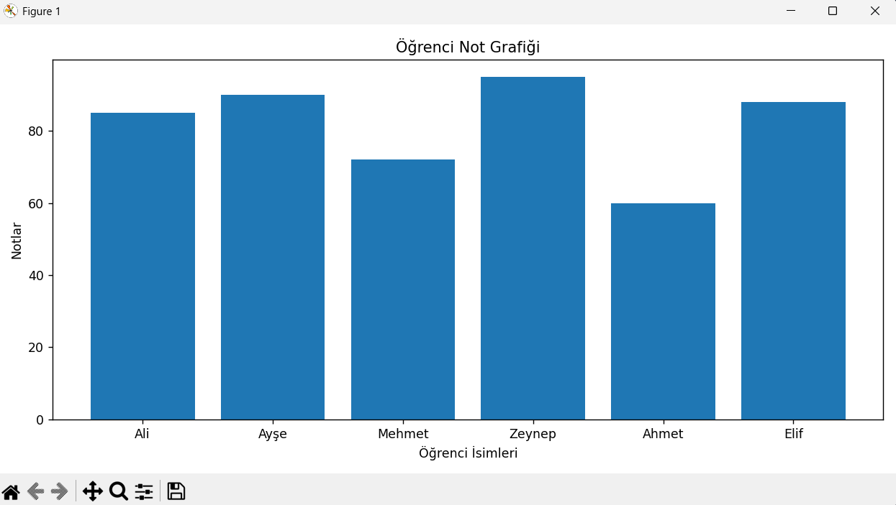

# Öğrenci Not Analiz Sistemi 📊

Bu proje, Python'da Nesne Yönelimli Programlama (OOP) prensipleri kullanılarak geliştirilmiş bir veri analizi ve görselleştirme aracıdır. 

Sistem, bir CSV dosyasındaki öğrenci verilerini (isim, yaş, bölüm, not) okur, Pandas ve NumPy kullanarak istatistiksel analizler yapar, veriyi belirli kriterlere göre filtreler ve Matplotlib ile sonuçları görselleştirir.

## 🚀 Özellikler

- **OOP Mimarisi:** Tüm işlemler `OgrenciNotAnalizSistemi` sınıfı üzerinden modüler bir şekilde yürütülür.
- **Veri Okuma ve Doğrulama:** Hatalı veya boş CSV dosyalarına karşı istisna yönetimi (Try-Except) uygulanmıştır.
- **Temel İstatistik (NumPy):** Sınıfın not ortalaması, en yüksek/en düşük notu ve standart sapması hesaplanır.
- **Veri Filtreleme (Pandas):** - Notu 80'den büyük olanlar
  - "Yapay Zeka" bölümünde okuyanlar
  - Yaşı 22'den büyük olanlar gibi özel sorgular yapılır.
- **Görselleştirme (Matplotlib):** Öğrenci isimleri ve not dağılımları bar grafiği (sütun grafik) olarak ekrana çizdirilir.

## 🛠️ Kullanılan Teknolojiler

- Python
- Pandas
- NumPy
- Matplotlib

## ⚙️ Kurulum ve Çalıştırma

Projeyi kendi bilgisayarınızda çalıştırmak için aşağıdaki adımları izleyebilirsiniz.

1. Depoyu klonlayın:
   ```bash
   git clone [https://github.com/burakk02/Ogrenci-not-analizi.git](https://github.com/burakk02/Ogrenci-not-analizi.git)
   cd Ogrenci-not-analizi
'''

   
